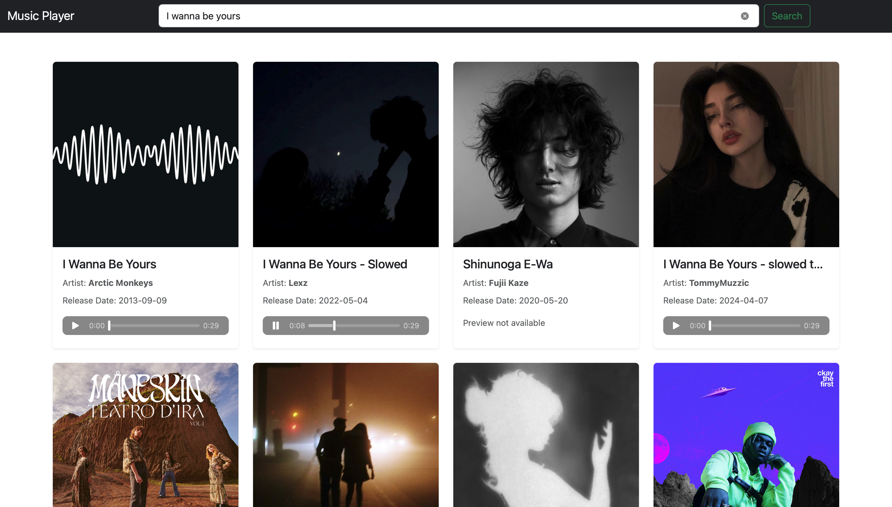

# Music Player

A responsive music player web application built using React and Bootstrap. This project allows users to play their favorite tracks with a clean and intuitive interface.

---

## Features

- Play, pause, and skip tracks.
- Responsive design using Bootstrap.
- Dynamic track listing.
- Simple and user-friendly interface.

---

## Technologies Used

- **React**: For building the user interface and managing state.
- **Bootstrap**: For styling and ensuring a responsive layout.

---

## Installation

1. Clone the repository:
   ```bash
   git clone https://github.com/sanchitwiz/music-player.git
   ```
2. Navigate to the project directory:
   ```bash
   cd music-player
   ```
3. Install dependencies:
   ```bash
   npm install
   ```
4. Start the development server:
   ```bash
   npm start
   ```

---

## Usage

- Open the app in your browser at `http://localhost:3000`.
- Select a track to play, pause, or skip to the next/previous track.

---

## Project Screenshot



---

## Contributing

Contributions are welcome! Please fork this repository and submit a pull request for any enhancements or bug fixes.

---


## Acknowledgments

- **React Documentation**: For providing excellent guides on React.
- **Bootstrap**: For enabling a seamless responsive design.

